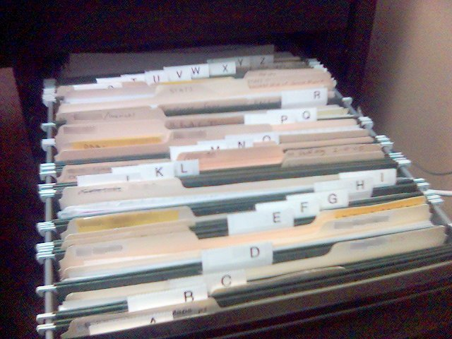

# Chapter 1: Chimpanzee and Elephant Save Christmas

It was holiday time at the North Pole, and letters from little boys and little girls all over the world flooded in as they always do. But this year there was a problem: the world had grown, and the elves just couldn't keep up with the scale of requests.

The elves' system was meticulous and neat, and well-suited to their personality.

But they knew their friends at the Chimpanzee & Elephant Computing Company could help.

The chimps came in, and singing a rather bawdy version of the Map-Reduce Haiku, built the following system:

### Letters => Toy Requests

In stage one, a chimpanzee reads each letter and fills out a work form for each requested toy. Some examples:

        --------------------------------------         # Joe is clearly a good kid, and thoughtful for his sister.         
                                                                                                                           
        Deer SANTA                                     robot | type="optimus prime" recipient="Joe"                        
                                                       hat   | type="girl's small"  recipient="Joe's sister Julia"         
        I wood like an optimus prime robot             
        and a hat for my sister julia                  
        
        I have been good this year
        
        love joe
        
        
        --------------------------------------          # Frank is a jerk. He will get coal.
                                                                                                                                 
        HEY SANTA I WANT A PONY AND NOT ANY             coal  | type="anthracity" recipient="Frank" reason="doesn't like to read"
        DUMB BOOKS THIS YEAR                           
                                                       
        FRANK

        ---------------------------------------         # Spam, no action
        
        Greetings to you Mr Claus, I came to know 
        of you in my search for a  reliable and 
        reputable person to handle a very confidential 
        business transaction, which involves the 
        transfer of a huge sum of money...
        
        
  
### Order Delivery

Each type of toy request -- robot, hat, coal, etc -- is handled by a different set of elves.

A line of pygmy elephants stands near each letter-reading station, one for each of the toymaking elves' workstations, and on the back of each elephant is a vertical file like you see on a very organized person's desk, with a slot for each type of toy:

Each toy wish is placed in the slot for that kind of toy. As the chimp is done with each mailbag, the elephants all trundle off to bring the elves a fresh batch of wishes, and a new line of elephants take their place.

### Toy Assembly

Lastly, the toy wishes come to dedicated workstations

         ROBOTS               PARCHEESI               COAL
         ROOMBAS              PONIES                  COAL
         RAZOR SCOOTERS       QUIDDITCH BROOMS        SCHOOL SUPPLIES

All wishes for a kind of toy go to the same workstation -- the station that sees wishes for Ponies sees every Pony wish. A station might handle several types of toys in a factory run, but it always sees them in a continuous batch. This is of great help to the elves, as the set-up for tying ribbons on Ponies is very different from trying to wrap a Quidditch Broom.

### Why it's efficient

Now it is still true that each elf workstation has incoming mail from every letter-reader. A constant stream of elephants are constantly dropping off order batches, some light, some heavy, even occasionally a shrug and an empty load. But the delivery isn't harum-scarum all-at-once, it's orderly and purposeful. If one workstation is slow, the elephants wait patiently -- it doesn't slow down the entire operation. And most importantly, all the work of organizing the work requests happens in parallel with reading the letters. It's pretty impressive.

* mail stage is partitioned
* letters have no guaranteed order

* consistent hashing smooths the workload 
  - but if it's a great year for Real American Dolls, that workstation can be overloaded. This is the problem of "skew", and we'll talk about this in some detail later.
